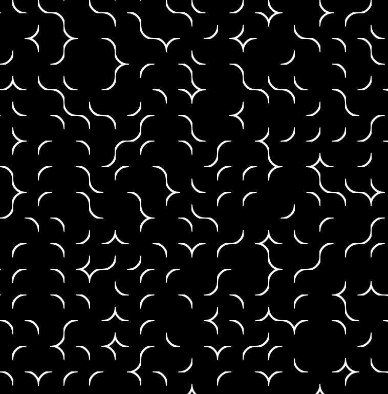
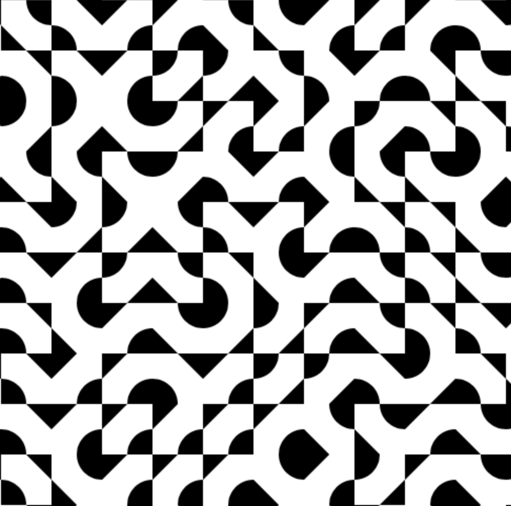
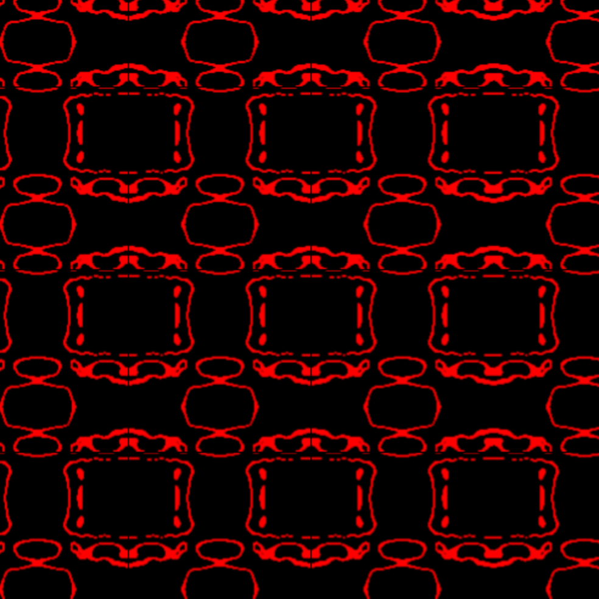

# p5js_patterns
experiments with p5js on pattern, generative and grid design
  
  

[triangles 1](https://b2renger.github.io/p5js_patterns/triangles_1/)

  

[rectangles 1](https://b2renger.github.io/p5js_patterns/rectangles_1/)

[rectangles 2](https://b2renger.github.io/p5js_patterns/rectangles_2/)

[rectangles 3](https://b2renger.github.io/p5js_patterns/rectangles_3/)

[rectangles 4](https://b2renger.github.io/p5js_patterns/rectangles_4/)

[rectangles 5](https://b2renger.github.io/p5js_patterns/rectangles_5/)
  
  

[rectangle lines 1](https://b2renger.github.io/p5js_patterns/rectangles_lines_1/)

[rectangle lines 2](https://b2renger.github.io/p5js_patterns/rectangles_lines_2/)
  
  

[circles 1](https://b2renger.github.io/p5js_patterns/circles_1/)

[circles 2](https://b2renger.github.io/p5js_patterns/circles_2/)
  
  

[10 print 1](https://b2renger.github.io/p5js_patterns/10_print_1/index.html)

[10 print 2](https://b2renger.github.io/p5js_patterns/10_print_2/)

[10 print 3](https://b2renger.github.io/p5js_patterns/10_print_3/)

[10 print 4](https://b2renger.github.io/p5js_patterns/10_print_4/)
  
  

[disarray 1](https://b2renger.github.io/p5js_patterns/disarray_1/)

[disarray 2](https://b2renger.github.io/p5js_patterns/disarray_2/)

[disarray 3](https://b2renger.github.io/p5js_patterns/disarray_3/)
  
  

[Geometric Shape Pattern](https://b2renger.github.io/p5js_patterns/geometric_shape_pattern/)
inspired by [Saskia Freeke](https://twitter.com/sasj_nl)'s work 

[Geometric Shape Pattern 2](https://b2renger.github.io/p5js_patterns/geometric_shape_pattern_2/)

[Geometric Shape Pattern 3](https://b2renger.github.io/p5js_patterns/geometric_shape_pattern_3/)

  
  

[supperpositions 1](https://b2renger.github.io/p5js_patterns/supperpositions_1/)

[supperpositions 2](https://b2renger.github.io/p5js_patterns/supperpositions_2/)
  
  

[snowflakes 1](https://b2renger.github.io/p5js_patterns/supperpositions_snowflakes_1/)

[snowflakes 2](https://b2renger.github.io/p5js_patterns/supperpositions_snowflakes_2/)
  
  

[offscreen graphics 1](https://b2renger.github.io/p5js_patterns/pg_1/)

[offscreen graphics 2](https://b2renger.github.io/p5js_patterns/pg_2/)

[offscreen graphics 3](https://b2renger.github.io/p5js_patterns/pg_3/)

[offscreen graphics 4](https://b2renger.github.io/p5js_patterns/pg_4/)

[offscreen graphics 5](https://b2renger.github.io/p5js_patterns/pg_5/)

[offscreen graphics 6](https://b2renger.github.io/p5js_patterns/pg_6/)

[offscreen graphics 7](https://b2renger.github.io/p5js_patterns/pg_7/)

[offscreen graphics 8](https://b2renger.github.io/p5js_patterns/pg_8/)

[animated texture with noise](https://b2renger.github.io/p5js_patterns/pg_animated_texture/)

[animated texture with noise looping](https://b2renger.github.io/p5js_patterns/pg_animated_texture_looping/)

[chaldni patterns](https://b2renger.github.io/p5js_patterns/chaldni_patterns/)
  
  

[palm leaf wireframe](https://b2renger.github.io/p5js_patterns/palm_leaf_wireframe/)

[palm leaf](https://b2renger.github.io/p5js_patterns/palm_leaf/)
  
  

