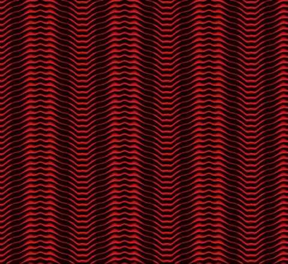
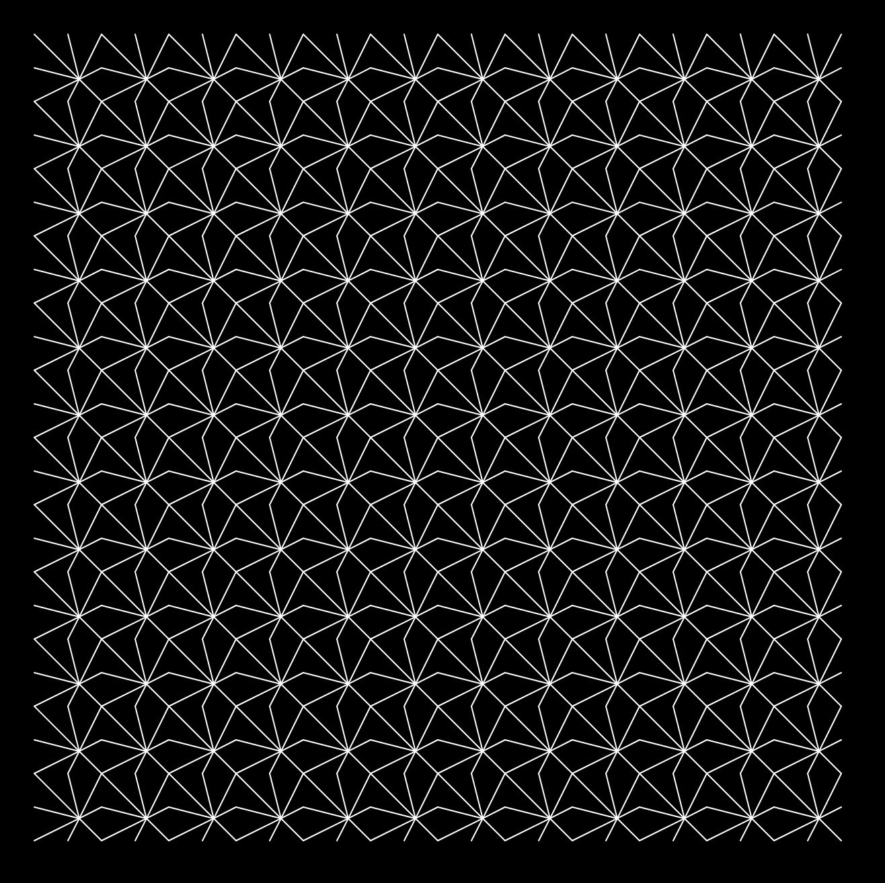

# p5js_patterns
experiments with p5js on pattern, generative and grid design
  
  

## art-deco inspired patterns
  

[Art deco 1 ](https://b2renger.github.io/p5js_patterns/art-deco_1/)

[Art deco 2 ](https://b2renger.github.io/p5js_patterns/art-deco_2/)

[Art deco - rectangles](https://b2renger.github.io/p5js_patterns/rectangles_6/)

[Art deco - butterfly](https://b2renger.github.io/p5js_patterns/butterfly/)

[Art deco - palm leaf](https://b2renger.github.io/p5js_patterns/palm_leaf/)

  
  

## Animated grids
  

[rectangles 2](https://b2renger.github.io/p5js_patterns/rectangles_2/)

[rectangles 3](https://b2renger.github.io/p5js_patterns/rectangles_3/)

[rectangles 4](https://b2renger.github.io/p5js_patterns/rectangles_4/)

[triangles 1](https://b2renger.github.io/p5js_patterns/triangles_1/)

[animated dots interpolation](https://b2renger.github.io/p5js_patterns/pg_animated_dots_interpolation/)

[animated dots interpolation with trace](https://b2renger.github.io/p5js_patterns/pg_animated_dots_interpolation_trace/)

[animated noise lines](https://b2renger.github.io/p5js_patterns/pg_animated_noise/)

[animated texture with noise](https://b2renger.github.io/p5js_patterns/pg_animated_texture/)

[animated texture with noise looping](https://b2renger.github.io/p5js_patterns/pg_animated_texture_looping/)

[simplex noise dragonfly](https://b2renger.github.io/p5js_patterns/noise/)

[animated gradients](https://b2renger.github.io/p5js_patterns/gradient_animated/)

  
  

## Grid things
  

[rectangles 1](https://b2renger.github.io/p5js_patterns/rectangles_1/)

[rectangles 5](https://b2renger.github.io/p5js_patterns/rectangles_5/)

[rectangle lines 1](https://b2renger.github.io/p5js_patterns/rectangles_lines_1/)

[rectangle lines 2](https://b2renger.github.io/p5js_patterns/rectangles_lines_2/)

[circles 1](https://b2renger.github.io/p5js_patterns/circles_1/)

[circles 2](https://b2renger.github.io/p5js_patterns/circles_2/)

[circles flowers](https://b2renger.github.io/p5js_patterns/circles_flowers/)

[fun flowers](https://b2renger.github.io/p5js_patterns/fun_flowers/)

[fun flowers overlapping](https://b2renger.github.io/p5js_patterns/fun_flowers_overlapping/)

[typographic grid polar coordinates(press the key to change the character displayed)](https://b2renger.github.io/p5js_patterns/typo_01/)

[typographic grid 2 repetition translation and rotation(press the key to change the character displayed)](https://b2renger.github.io/p5js_patterns/typo_02_frise1_translation/)

[typographic grid 3 repetition refmexop, and rotation(press the key to change the character displayed)](https://b2renger.github.io/p5js_patterns/typo_03_frise2_reflexion/)

[arcs](https://b2renger.github.io/p5js_patterns/arcs_01/)

### Cubic Disarray inspired - (orignal work by Georg Nees)
  

[disarray 1](https://b2renger.github.io/p5js_patterns/disarray_1/)

[disarray 2](https://b2renger.github.io/p5js_patterns/disarray_2/)

[disarray 3](https://b2renger.github.io/p5js_patterns/disarray_3/)

  
  

### 10 print inspired - [10 print book](https://10print.org/)
  

[10 print 1](https://b2renger.github.io/p5js_patterns/10_print_1/index.html)

[10 print 2](https://b2renger.github.io/p5js_patterns/10_print_2/)

[10 print 3](https://b2renger.github.io/p5js_patterns/10_print_3/)

[10 print 4](https://b2renger.github.io/p5js_patterns/10_print_4/)

  
  

## Supperpositions
  

[supperpositions 1](https://b2renger.github.io/p5js_patterns/supperpositions_1/)

[supperpositions 2](https://b2renger.github.io/p5js_patterns/supperpositions_2/)

[supperpositions 3](https://b2renger.github.io/p5js_patterns/supperpositions_3)

[snowflakes 1](https://b2renger.github.io/p5js_patterns/supperpositions_snowflakes_1/)

[snowflakes 2](https://b2renger.github.io/p5js_patterns/supperpositions_snowflakes_2/)

[radial-lines](https://b2renger.github.io/p5js_patterns/radial_lines/index.html)

[radial-lines with probabilities](https://b2renger.github.io/p5js_patterns/radial_lines_with_probabilities/index.html)

  
  

## Superposing grids
  

[Geometric Shape Pattern](https://b2renger.github.io/p5js_patterns/geometric_shape_pattern/)
inspired by [Saskia Freeke](https://twitter.com/sasj_nl)'s work 

[Geometric Shape Pattern 2](https://b2renger.github.io/p5js_patterns/geometric_shape_pattern_2/)

[Geometric Shape Pattern 3](https://b2renger.github.io/p5js_patterns/geometric_shape_pattern_3/)

[blue rafters](https://b2renger.github.io/p5js_patterns/rafters_generative/index.html)

[blue rafters 2](https://b2renger.github.io/p5js_patterns/rafters_generative_2/index.html)

[blue rafters 3](https://b2renger.github.io/p5js_patterns/rafters_generative_3/index.html)

[overlapping circles](https://b2renger.github.io/p5js_patterns/overlapping_circles_generative/index.html)

  
  

## Truchet inspired
  

[offscreen graphics 1](https://b2renger.github.io/p5js_patterns/pg_1/)

[offscreen graphics 2](https://b2renger.github.io/p5js_patterns/pg_2/)

[offscreen graphics 3](https://b2renger.github.io/p5js_patterns/pg_3/)

[offscreen graphics 4](https://b2renger.github.io/p5js_patterns/pg_4/)

[offscreen graphics 5](https://b2renger.github.io/p5js_patterns/pg_5/)

[offscreen graphics 6](https://b2renger.github.io/p5js_patterns/pg_6/)

[offscreen graphics 7](https://b2renger.github.io/p5js_patterns/pg_7/)

[offscreen graphics 8](https://b2renger.github.io/p5js_patterns/pg_8/)

[offscreen graphics with gradients](https://b2renger.github.io/p5js_patterns/pg_gradient/)

  
  

## Misc
  

[optical illusion 1](https://b2renger.github.io/p5js_patterns/illusion_01/)

[chladni patterns](https://b2renger.github.io/p5js_patterns/chladni_patterns/)

[chrysanthemum webgl](https://b2renger.github.io/p5js_patterns/chrysanthemum/)

[palm leaf wireframe](https://b2renger.github.io/p5js_patterns/palm_leaf_wireframe/)

[grid of recursive cubes](https://b2renger.github.io/p5js_patterns/webgl_3D/)

  
  

